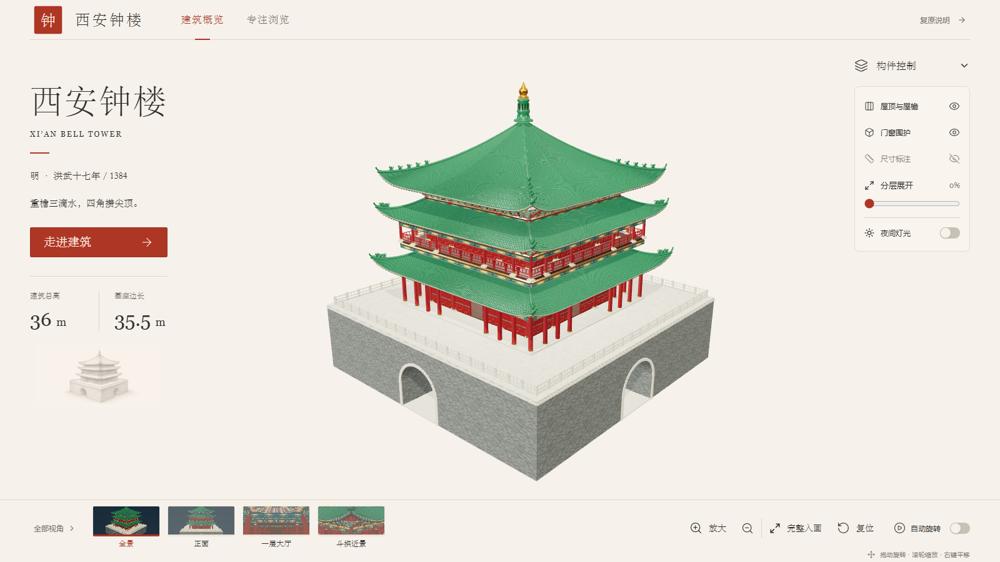
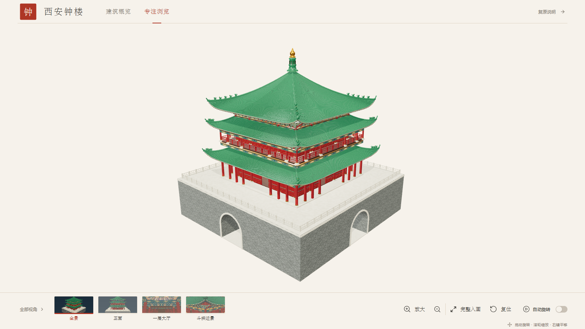
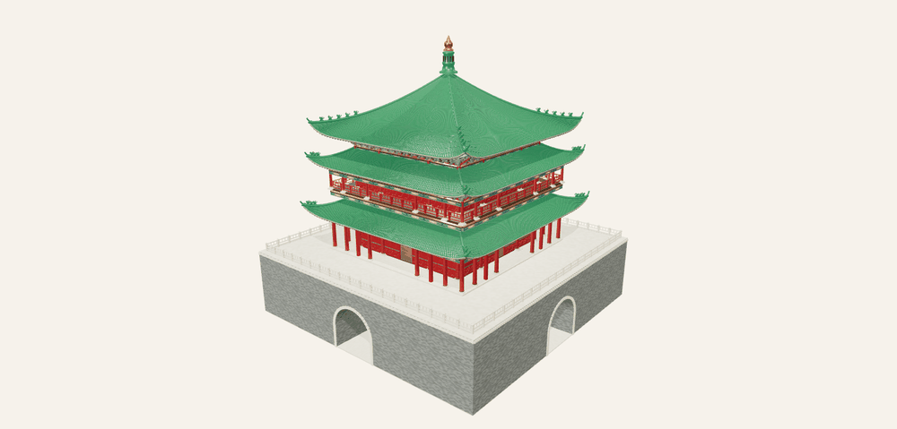
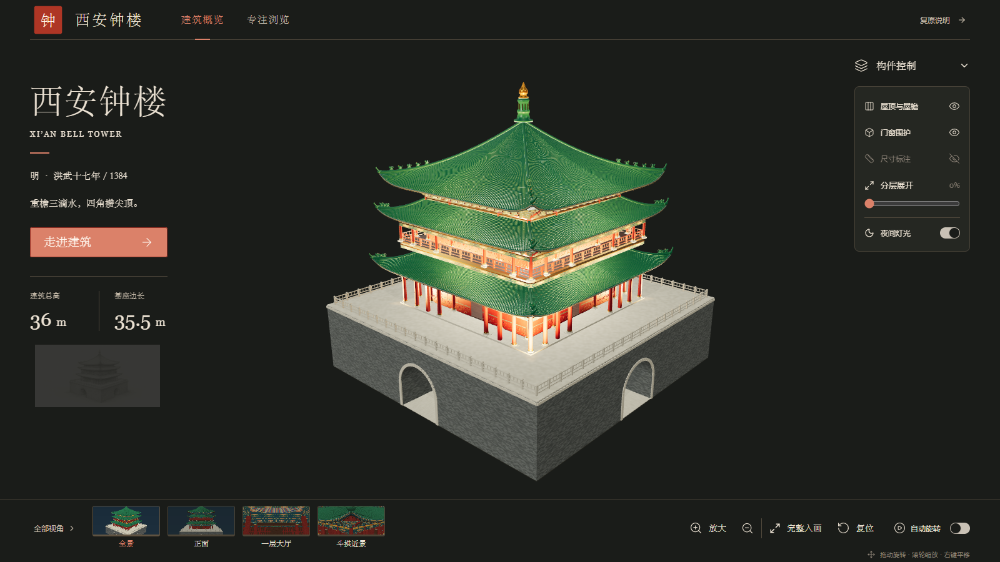

# 用 GPT 6 把西安钟楼做成一个可以走进去的网页 3D 模型

如果只输入一句“帮我做一个西安钟楼”，AI 很容易给出一座看起来像古建筑的空壳。

这次我想做得更完整一些：钟楼要有青砖基座和四向连通的十字券洞，要表现两层楼阁、三重屋檐、立柱、梁枋、斗拱和彩绘天花；它还要能进入浏览器，让人直接旋转、缩放、切换视角和查看内部空间。

最终得到的是一份带完整材质的 GLB，以及一个围绕模型浏览设计的网页。

> **在线体验：[https://demo.darmk.com.cn/xianBellTower/](https://demo.darmk.com.cn/xianBellTower/)**  
> 建议使用开启硬件加速的 Chrome、Edge 或 Firefox。模型约 14 MiB，首次打开需要一点加载时间。

## 关注公众号引导

创作不易，感谢支持。扫码关注公众号，继续发掘更多精彩内容和作品。

<p align="center">
  
</p>

## 项目介绍

### 这不是一张效果图，而是一座可操作的建筑模型

页面初始展示钟楼全貌。左侧保留建筑名称、年代和关键尺度，中间是实时 3D 模型，右侧控制构件，底部集中放置视角与相机操作。界面使用接近宣纸的暖色背景，让绿色琉璃瓦、朱红木构和灰砖基座成为视觉主体。



*图 1｜当前线上版本的建筑概览。模型、说明、构件控制和常用视角位于同一屏。*

这个页面不要求使用者理解三维软件。拖动鼠标就能旋转，滚轮可以缩放，右键用于平移；预设视角可以直接进入正面、一层大厅、斗拱、二层梁架、室内楼梯、十字券洞和鎏金宝顶。

点击“专注浏览”后，说明和控制面板会暂时收起，把主要空间留给模型。它适合连续观察建筑比例，也适合投屏展示。



*图 2｜专注浏览模式。页面只保留模型、视角缩略图和必要的相机操作。*

下面这张动图直接录制自线上页面的自动旋转状态。四个立面、三重檐轮廓、基座券洞和外部楼梯，都来自同一份 GLB。



*动图｜网页实时模型环绕展示。为方便阅读，动图经过缩放和帧率压缩。*

页面还提供屋顶与屋檐、门窗围护、尺寸标注、分层展开和夜间灯光等控制。夜间模式不仅改变背景，也会重新组织场景照明，让檐下和楼身的空间层次更容易辨认。



*图 3｜夜间灯光模式。暖色照明强调柱廊、檐下构件和楼身结构。*

### 模型包含什么

模型采用米制单位，整体尺度由参数控制。这里的“1:1”表示建模单位与总体尺寸一致，不表示每个斗拱、脊兽和雕饰都来自现场测绘。

| 项目 | 当前结果 |
| --- | --- |
| 建筑总高 | 36 m |
| 基座主体 | 35.5 × 35.5 × 8.6 m |
| 主体关系 | 两层楼阁、三重檐、四角攒尖顶 |
| 几何规模 | 765,636 个三角面、41 个网格 |
| 材质 | 8 套 PBR 材质、24 张内嵌贴图 |
| GLB 体积 | 约 14 MiB |
| 格式检查 | glTF Validator 0 错误、0 警告 |

建筑被拆分为基座、券洞、外部楼梯、立柱、梁枋、楼板、门窗、栏杆、斗拱、三重屋面和宝顶等构件组。隐藏屋顶、关闭门窗或使用分层展开时，网页操作的是这些真实的构件分组。

其中，总体尺度、层数和三重檐关系有明确控制；楼梯完整走向、斗拱节点、屋面曲线、脊兽配置及部分雕饰属于研究性复原。模型用于建筑展示和空间理解，不作为修缮施工或测绘依据。

## 怎么实现的

### 第一步：先定义交付结果

这类任务最容易出问题的地方，不是代码写不出来，而是目标没有说清楚。

开始建模前，我先和 GPT 6 明确四件事：建什么、做到什么程度、用什么方式实现、最后交付什么。确认后的目标是：以西安钟楼为对象，覆盖外观和主要内部空间；用真实总体尺度约束比例，对资料缺口保留推定说明；使用 Three.js 参数化生成，不依赖 Blender；最终交付 GLB 和浏览器查看页。

可以把这种协作方式概括成三个阶段：

1. 收集资料，区分有来源的数据、图示推导和暂定参数。
2. 先提交建模与验收方案，确认范围后再开始生成。
3. 导出模型，完成格式、几何和网页展示检查后再交付。

GPT 6 在这里负责把自然语言需求整理成可以执行和验收的规则，Codex 负责编辑代码、运行工具和检查结果。人的作用是确认范围、判断依据是否充分，并在关键节点决定取舍。

### 第二步：把建筑变成参数和构件

整体尺寸先进入参数表，而不是散落在聊天记录和代码常量里：

```js
const building = {
  unit: 'm',
  base: { width: 35.5, depth: 35.5, height: 8.6 },
  totalHeight: 36,
  floors: 2,
  eaves: 3,
};
```

随后，建模脚本用盒体、柱体、挤出轮廓、曲线路径和自定义网格生成不同构件。重复出现的柱、栏杆、瓦带和斗拱由循环批量创建；屋面则通过曲面参数计算起坡、收分和角部起翘。

基座不能只是一个封闭方盒。四面的拱券需要连接到内部十字通道，拱腹、侧壁、地面和中央交汇处都要形成真实几何，这样相机进入券洞时才不会看到空壳。

木构部分同样需要处理连接关系：柱网先确定，梁枋按标高生成，楼板为室内楼梯留下洞口，二层梁架与屋顶内部相接。外观渲染只是第一轮检查，真正进入大厅、楼梯和屋顶下方，才能发现穿插、悬空和错误遮挡。

### 第三步：生成 PBR 材质并导出 GLB

项目使用青砖、石材、朱红木构、深色木材、绿琉璃瓦、贴金、梁枋彩绘和天花彩绘 8 套材质。

每套材质不只有颜色图，还包含法线和 ORM 信息。法线表现细小凹凸；ORM 的三个通道分别保存环境遮蔽、粗糙度和金属度。青砖更粗糙，琉璃瓦具有明显釉面反光，宝顶使用金属属性，彩绘则使用更高分辨率的颜色贴图。

Three.js 负责生成几何，glTF-Transform 负责组织材质、节点和缓冲数据。导出前会清理无用属性、剔除退化三角面、重新计算切线，并使用 Meshopt 压缩。贴图全部嵌入 GLB，部署时不需要再维护一组容易丢失的外部贴图路径。

导出之后还要做两类检查：

- 使用 glTF Validator 检查格式、扩展和访问器是否合法。
- 独立解码 GLB，检查顶点坐标、三角面、总体尺寸和关键构件数量。

效果图同样属于检查工具。曾经出现过直线椽条穿出弯曲屋面的情况，正是通过多视角渲染发现，再回到生成规则里修正曲线和长度。

### 第四步：在浏览器中加载和控制模型

网页由 React、Vite 和 Three.js 构建。Three.js 场景包含透视相机、环境光、主光、补光、夜间灯光和轨道控制器；GLTFLoader 配合 MeshoptDecoder 加载压缩后的模型。

为了部署到域名的二级目录，页面不会把模型路径写死为站点根目录，而是统一加上 Vite 的基础路径：

```ts
export function publicAsset(path: string): string {
  return `${import.meta.env.BASE_URL}${path.replace(/^\/+/, '')}`;
}

loader.load(publicAsset('model/xian-bell-tower.glb'), onLoad);
```

因此，正式环境中的页面、脚本、图片和模型请求都会落在：

```text
/xianBellTower/
/xianBellTower/assets/
/xianBellTower/images/
/xianBellTower/model/
```

相机不是简单写死一个距离。查看器会读取模型包围盒，并根据画布宽高、相机视角和安全边距计算初始距离，使钟楼在不同屏幕中尽量完整、醒目地进入画面。用户旋转或缩放后，自动适配会停止干预；点击“完整入画”或“复位”时再重新计算。

模型底部没有额外的白色实体背景。WebGL 画布使用透明背景，地面只接收半透明阴影，因此日间与夜间模式可以和页面颜色连续衔接。底部视角栏也独立占位，放大模型时不会盖住画布中的建筑主体。

### 第五步：打包成 Nginx 可以直接托管的静态网站

项目最终整理为标准 Vite 静态站点：

```text
src/             React 页面、样式和 Three.js 查看器
public/          GLB、视角图、页面图片和图标
scripts/model/   模型、纹理和视角图生成脚本
dist/            npm run build 生成的部署文件
```

运行 `npm run build` 后会直接生成 `dist/index.html`，不需要在服务器上启动 Node.js。把 `dist` 里的全部内容上传到 `/home/project/www/xianBellTower/`，由 Nginx 提供静态文件即可。

```nginx
location = /xianBellTower {
    return 301 /xianBellTower/$is_args$args;
}

location ^~ /xianBellTower/ {
    root /home/project/www;
    index index.html;
    try_files $uri $uri/ /xianBellTower/index.html;
}
```

完成这一步后，一条自然语言需求就变成了可以检查、修改和交付的完整链路：需求约束进入参数，参数生成构件，构件组成 GLB，GLB 进入网页，网页再以静态文件部署到线上。

这次实践最有价值的地方，不是让 AI 一次性猜中所有细节，而是把复杂任务拆成一系列看得见的中间结果。方案可以确认，尺寸可以核对，模型可以旋转，错误可以回到代码里修正，最后的网页也能直接打开验证。

> 本文截图和动态图采集于项目线上页面，时间为 2026 年 9 月。建筑总体尺寸参考公开报道与前期资料整理；局部复原不代表历史测绘结论。
